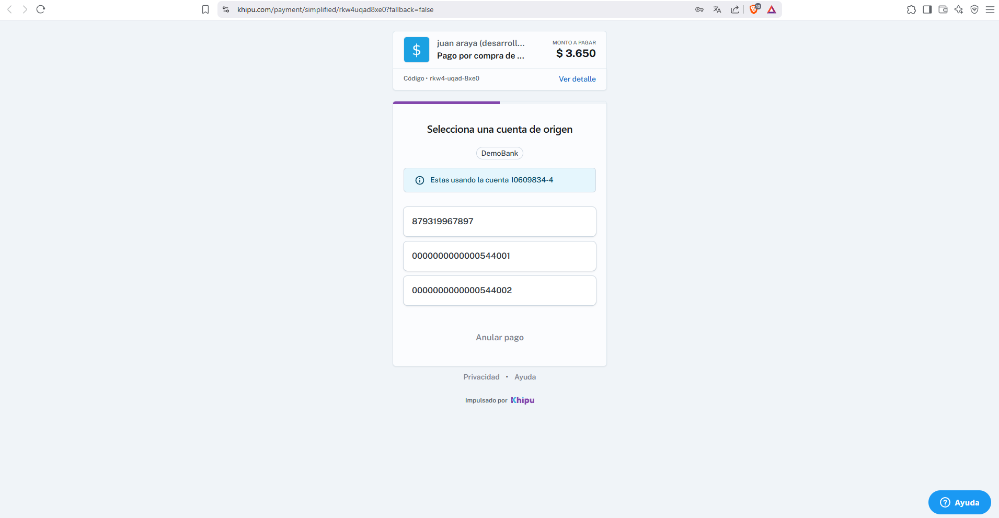
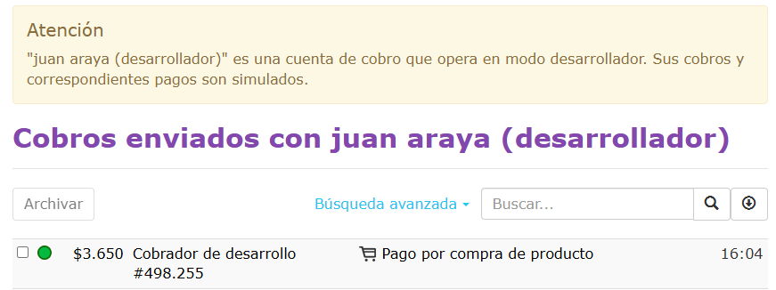

# Imágenes del proyecto

Aquí están las capturas relevantes del proceso de integración y pruebas con la API de Khipu.

---

### 1. Generador de enlace de pago en Python

---

### 2. Selección de Banco en Khipu

---

### 3. Selección de cuenta en DemoBank

---

### 4. Transferencia realizada

---

### 5. Confirmación de pago en la página de desarrollador

